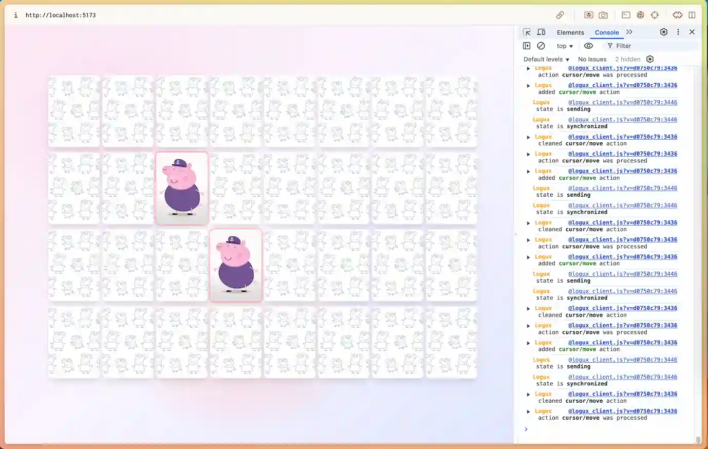

# Logux Card Memory Game

A real-time multiplayer memory card game built with React, Logux, and featuring Peppa Pig characters. Players can collaborate to find matching pairs, with live cursor tracking and synchronized game state across all connected clients.



## ✨ Features

- **Real-time Multiplayer**: Multiple players can play simultaneously with synchronized game state
- **Live Cursor Tracking**: See other players' mouse cursors in real-time
- **Drag & Drop**: Cards can be moved around the game board
- **Responsive Design**: Works on both desktop and mobile devices with touch support
- **Animated Card Flips**: Smooth 3D card flip animations using Framer Motion
- **Auto-shuffle**: Automatically shuffle cards when all pairs are found
- **Sound Effects**: Audio feedback for matching pairs
- **Character Matching**: Features beloved Peppa Pig characters

## 🚀 Technologies Used

### Frontend

- **React 19** - UI framework
- **TypeScript** - Type safety
- **Tailwind CSS** - Styling and responsive design
- **Framer Motion** - Animations and transitions
- **React DnD** - Drag and drop functionality
- **Nanostores** - State management
- **Vite** - Build tool and development server

### Backend

- **Logux Server** - Real-time synchronization
- **Node.js** - Server runtime
- **WebSocket** - Real-time communication

### DevOps & Tools

- **ESLint** - Code linting
- **Prettier** - Code formatting
- **TypeScript compiler** - Type checking

## 🎮 Game Logic

The game implements a classic memory card matching game with the following mechanics:

1. **Card Grid**: 32 cards arranged in a 4x8 grid (16 unique character pairs)
2. **Flip Mechanism**: Click cards to flip them face-up
3. **Matching Logic**: Two flipped cards are checked for character match
4. **Auto-Hide**: Non-matching cards automatically flip back after 1 second
5. **Pair Tracking**: Matched pairs remain face-up and are marked as found
6. **Win Condition**: Game completes when all pairs are found
7. **Shuffle Feature**: Cards can be reshuffled for a new game

## 🏗️ Architecture

### Client-Side State Management

- **Cards Store** (`src/stores/cards.ts`): Manages card positions, states, and matching logic
- **Cursors Store** (`src/stores/cursors.ts`): Tracks other players' cursor positions
- **Logux Integration** (`src/logux.ts`): Handles real-time synchronization

### Server-Side Logic

- **Game State**: Server maintains authoritative game state
- **Action Processing**: Handles card flips, moves, and match validation
- **Real-time Broadcasting**: Synchronizes state changes across all clients
- **Shuffle System**: Randomizes card positions while maintaining game integrity

### Component Architecture

- **Canvas**: Main game board with drop zone functionality
- **Card**: Individual card component with drag/flip interactions
- **Cursor**: Real-time cursor display for other players
- **CustomDragLayer**: Mobile-friendly drag preview

## 🛠️ Setup & Installation

### Prerequisites

- Node.js 18+
- npm or yarn

### Installation

1. Clone the repository:

```bash
git clone <repository-url>
cd logux-card-app
```

2. Install dependencies:

```bash
npm install
```

3. Start the development server:

```bash
npm run dev
```

This command will start both the Logux server (port 31337) and the Vite development server with hot reload.

### Available Scripts

- `npm run dev` - Start both the Logux server and Vite development server with hot reload
- `npm run server` - Start only the Logux server

## 🎯 Usage

1. **Start the Game**: Open the application in your browser
2. **Flip Cards**: Click on cards to flip them face-up
3. **Find Matches**: Try to find matching character pairs
4. **Move Cards**: Drag cards to rearrange them on the board
5. **Multiplayer**: Share the URL with friends to play together
6. **Shuffle**: When all pairs are found, use the shuffle button to start a new game

## 🔧 Development

### Project Structure

```
src/
├── components/          # React components
│   ├── Canvas.tsx      # Main game board
│   ├── Card.tsx        # Individual card component
│   ├── Cursor.tsx      # Cursor display
│   └── CustomDragLayer.tsx
├── stores/             # Nanostores state management
│   ├── cards.ts        # Card state
│   └── cursors.ts      # Cursor tracking
├── utils/              # Utility functions
│   ├── canvas.ts       # Canvas calculations
│   ├── deviceDetection.ts
│   └── sound.ts        # Audio handling
├── types.ts            # TypeScript definitions
└── logux.ts           # Logux client configuration
```

### Key Files

- `server.js` - Logux server with game logic
- `src/App.tsx` - Main application component
- `src/logux.ts` - Client-side Logux configuration
- `package.json` - Dependencies and scripts

### Adding New Features

1. **New Card Actions**: Add action types to `src/types.ts` and implement handlers in `server.js`
2. **UI Components**: Create new components in `src/components/`
3. **Game Logic**: Modify server-side logic in `server.js`
4. **Styling**: Use Tailwind CSS classes for consistent styling

## 🎨 Customization

### Adding New Characters

1. Add character images to `public/` folder
2. Update the `INITIAL_CARDS` array in `server.js`
3. Ensure each character has exactly 2 cards for proper pairing

### Modifying Game Rules

- **Grid Size**: Adjust card positions in `INITIAL_CARDS`
- **Flip Delay**: Modify timeout in `checkForMismatchedPairs()`
- **Match Logic**: Update character comparison in server actions

## 🌐 Deployment

### Production Build

```bash
npm run build
```

### Server Deployment

The application requires both a static file server for the frontend and a Node.js server for the Logux backend:

1. **Frontend**: Deploy `dist/` folder to any static hosting service
2. **Backend**: Deploy `server.js` to a Node.js hosting platform
3. **Configuration**: Update Logux server URL in client configuration

### Environment Variables

- `PORT` - Server port (default: 31337)
- `HOST` - Server host (default: 0.0.0.0)

## 🤝 Contributing

1. Fork the repository
2. Create a feature branch
3. Make your changes
4. Add tests if applicable
5. Submit a pull request

## 📝 License

This project is open source and available under the [MIT License](LICENSE).

## 🎵 Credits

- Character images and sound effects: AI generated based on Peppa Pig franchise
- Built with ❤️ using modern web technologies
